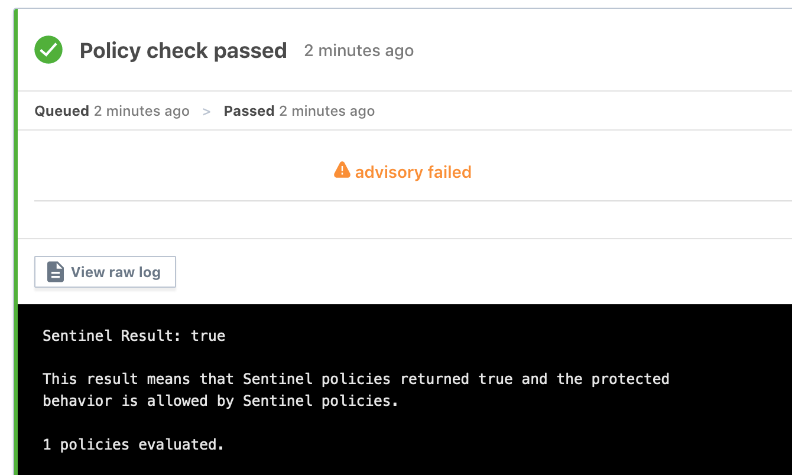

# Lab 23: Terraform Enterprise - Sentinel Policy Use

## Expected Outcome

In this challenge, you will see how you can apply policies using Sentinel Policy-as-Code.

## How to

### View Policies

In the Terraform Enterprise web app, click on your organization -> Organization Settings

<https://TFE_HOSTNAME/YOUR_ORG_NAME/settings/policies>


### Create Policy Set

First we need a place to stor our policies, namely a Policy Set.

On the left menu, click the "Policy set" tab.

Click "Create new policy set"


Create the following policy:


Create the following policy:

__Name:__ GlobalWorkspacePolicies

__Description:__ Global policies.

__Policy Set Source__: Select Upload Via API

__Scope of Policies:__ Select -> "Policies enforced on all workspaces"

__Policies:__ Select the Policy created above -> Click "Add"


### Create Policy

Now lets create a Policy to enforce governance.

Click "Create new policy"


Create the following policy:

__Policy Name:__ RequireMandatoryTags

__Description:__ Policy Enforcing Mandatory Tags

__Policy Enforcement:__ advisory (logging only)

__Policy Code:__

```hcl
# This policy uses the Sentinel tfplan import to require that all EC2 instances
# have all mandatory tags.

# Note that the comparison is case-sensitive since AWS tags are case-sensitive.

##### Imports #####

import "tfplan"
import "strings"
import "types"

##### Functions #####

# Find all resources of a specific type from all modules using the tfplan import
find_resources_from_plan = func(type) {

  resources = {}

  # Iterate over all modules in the tfplan import
  for tfplan.module_paths as path {
    # Iterate over the named resources of desired type in the module
    for tfplan.module(path).resources[type] else {} as name, instances {
      # Iterate over resource instances
      for instances as index, r {

        # Get the address of the instance
        if length(path) == 0 {
          # root module
          address = type + "." + name + "[" + string(index) + "]"
        } else {
          # non-root module
          address = "module." + strings.join(path, ".module.") + "." +
                    type + "." + name + "[" + string(index) + "]"
        }

        # Add the instance to resources map, setting the key to the address
        resources[address] = r
      }
    }
  }

  return resources
}

# Validate that all instances of specified type have a specified top-level
# attribute that contains all members of a given list
validate_attribute_contains_list = func(type, attribute, required_values) {

  validated = true

  # Get all resource instances of the specified type
  resource_instances = find_resources_from_plan(type)

  # Loop through the resource instances
  for resource_instances as address, r {

    # Skip resource instances that are being destroyed
    # to avoid unnecessary policy violations.
    # Used to be: if length(r.diff) == 0
    if r.destroy and not r.requires_new {
      print("Skipping resource", address, "that is being destroyed.")
      continue
    }

    # Determine if the attribute is computed
    # We check "attribute.%" and "attribute.#" because an
    # attribute of type map or list won't show up in the diff
    if (r.diff[attribute + ".%"].computed else false) or
       (r.diff[attribute + ".#"].computed else false) {
      print("Resource", address, "has attribute", attribute,
            "that is computed.")
      # If you want computed values to cause the policy to fail,
      # uncomment the next line.
      # validated = false
    } else {
      # Validate that the attribute is a list or a map
      # but first check if r.applied[attribute] exists
      if r.applied[attribute] else null is not null and
         (types.type_of(r.applied[attribute]) is "list" or
          types.type_of(r.applied[attribute]) is "map") {

        # Evaluate each member of required_values list
        for required_values as rv {
          if r.applied[attribute] not contains rv {
            print("Resource", address, "has attribute", attribute,
                  "that is missing required value", rv, "from the list:",
                  required_values)
            validated = false
          } // end rv
        } // end required_values

      } else {
        print("Resource", address, "is missing attribute", attribute,
              "or it is not a list or a map")
        validated = false
      } // end check that attribute is list or map

    } // end computed check
  } // end resource instances

  return validated
}

### List of mandatory tags ###
mandatory_tags = [
  "Name",
  "ttl",
  "owner",
]

### Rules ###

# Call the validation function
tags_validated = validate_attribute_contains_list("aws_instance",
                 "tags", mandatory_tags)

#Main rule
main = rule {
  tags_validated
}
```

__Policy Sets__: Select the Policy Set we just created "GlobalWorkspacePolicies". (And be sure to click the add button to the right)

### Run a Plan

> Note: be sure to discard any existing plans.

Navigate to your "app-web" and queue a plan.

### Review the Plan

Will see the plan was successful but there was a policy failure, however the option to Apply is still available. Why is that?



**Discard the plan.**

### Update the Policy

Navigate back the policy definition (/settings/policies)

Update the Policy Enforcement to be `hard-mandatory`.

### Run a Plan

Queue a plan for the workspace.

### Review the Plan

This time the the run fails due to the hard enforcement.


## Advanced areas to explore

1. Write another Sentinel Policy restricting availablity zones to launch EC2 instances.

## Resources

- [Policy Examples](https://github.com/hashicorp/terraform-guides/tree/master/governance/second-generation)
- [Sentinel Language Spec](https://docs.hashicorp.com/sentinel/language/spec)
